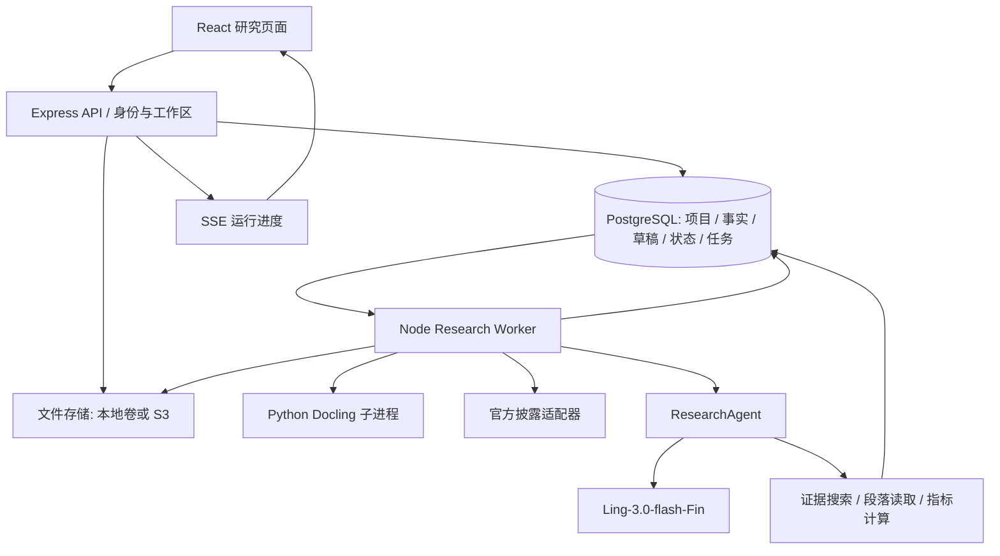

# 02 总体架构与技术选型

## 1. 总体设计

选定「模块化单体 + 持久化后台 Worker」。同一仓库、同一套领域类型、一个数据库，API 和 Worker 分进程运行。复杂的财报解析与模型调用不占住浏览器请求，也不拆成一串独立微服务。



图中是一个 Agent 和多个确定性功能模块，不是因为有五个阶段就宣称有五个独立 Agent。Agent 的价值在于根据观点决定找什么证据、使用什么工具、缺什么、是否继续补查。

## 2. 确定的技术组合

| 层 | 选型 | 实现理由 |
|---|---|---|
| 前端 | React + TypeScript + Vite，现有样式体系 | 复用当前工程，重做主流程而非更换框架 |
| 页面状态 | React 路由层 + 自有小型 API hooks | 两个主要页面，无需引入大型前端状态框架；服务端是研究状态唯一来源 |
| API | 现有 Express，Zod 校验，OpenAPI 3.1 | 复用服务组织，新增异步接口与强类型载荷 |
| Agent | TypeScript 明确阶段编排 + 有界工具循环 | 阶段可恢复、工具可测试，不增加通用 Agent 框架依赖 |
| 模型 | Ling-3.0-flash-Fin，OpenAI-compatible 适配器 | 延续指定核心模型；具体 endpoint/model ID 由部署配置 |
| 财务计算 | Decimal.js + 固定公式注册表 | 金额、比例、同比、口径检查由代码执行 |
| PDF 解析 | Python Docling；原生文本优先，必要页面 OCR | 表格、段落和页面位置进入统一中间格式 |
| PDF 查看 | PDF.js + 自有引用高亮层 | 点击结果回到源文件真实页 |
| 检索 | 元数据过滤 + 中文 bigram/术语词典 BM25 | 单公司文件包可低成本检索；事实先走结构化索引 |
| 数据库 | PostgreSQL 18，SQL migrations + node-postgres | API/Worker 共用持久事务、草稿、任务和版本 |
| 任务队列 | PostgreSQL jobs 表，租约、重试、阶段检查点 | 不再依赖进程内 Map；无需额外 Redis |
| 文件 | StorageAdapter；默认持久磁盘，S3 为同一接口的云端实现 | 原始 PDF、解析 JSON、缩略图分离存储 |
| 官方资料获取 | TypeScript provider + Playwright 公共检索适配器 | 用真实公告目录匹配公司和报告，不让模型猜 PDF URL |
| 登录 | 云端 OIDC + 服务端 session；本地回环单用户模式 | 完成私有展示所需身份隔离，不建设用户运营系统 |
| 交付 | Docker Compose，API 与 Worker 共用构建产物 | 一台机器可启动，解析进程按资源单独限额 |

Docling 文档包含结构化文档及页级定位表示；接入时统一转换为本产品的 `pageNumber/bbox`，不让第三方结构污染业务对象。[Docling 文档](https://docling-project.github.io/docling/reference/docling_document/)

数据库队列采用 PostgreSQL 明确支持的 `FOR UPDATE SKIP LOCKED` 领取方式；它适合队列表，不作为普通研究数据查询的一致性策略。[PostgreSQL SELECT](https://www.postgresql.org/docs/current/sql-select.html)

## 3. 模块边界

目标目录（开发时创建，本次设计文档不创建业务实现）：

```text
src/
  shared/          # domain、Zod schemas、metric registry、API DTO
  server/
    api/           # uploads、projects、runs、drafts、sources、exports
    auth/          # OIDC、session、workspace context
    repos/         # SQL 持久化，所有查询带 workspace context
    documents/     # 文件接收、解析版本、EvidenceSpan
    disclosures/   # 公司目录、CNINFO/SSE provider、报告包选择
    facts/         # 表格标准化、指标映射、事实候选确认
    agent/         # planner、tool loop、verification、diff
    memory/        # 版本写入、用户修正、context compiler
    jobs/          # queue、lease、checkpoint、scheduler
    storage/       # local / S3 adapter
  worker.ts
  pages/           # ResearchHome、ProjectResearchPage
  components/research/
python/document_parser/
db/migrations/
tests/{unit,contract,integration,e2e,eval}/
```

API 负责权限、参数、事务入口和读取。Worker 负责慢任务。Repo 不调用模型；模型不能直接写已确认的研究状态。解析器只接收文件和解析选项，不持有项目数据库或模型密钥。

## 4. 当前代码到目标架构

基线：2026-09-03 本地 `codex/continuous-research`，HEAD `13a42f6`，存在大量未提交变更。本表基于当前工作区读取，不把 HEAD 当成全部代码。

| 当前模块 | 处理方式 |
|---|---|
| `continuousAnalyzer.ts` | 复用规划/工具循环思路，迁入可持久恢复的 ResearchAgent；入口改为提取的观点与财报包 |
| `researchModel.ts` | 保留 provider 适配，补模型能力探测、JSON 验证、调用记录 |
| `researchTools.ts` | 保留搜索/读取/计算抽象；接入真实 PDF spans、结构化 facts、官方来源获取 |
| `fintrustEngine.ts` | 复用 Decimal 计算与可用测试，补期间/单位/口径语义 |
| `claimVerification.ts` | 原文定位检查作为一道校验；增加数值条件与语义关系判断，不能把字符串命中当支持 |
| `buildResearchContext.ts` | 复用版本、问题、用户修正的上下文组织；升级为明确优先级的 context compiler |
| `projectRepo.ts`、`db.ts` | 提取可复用事务语义，SQL.js 数据经一次迁移进入 PostgreSQL |
| `app.ts` | 替换手写观点主入口、同步分析请求、内存草稿；旧兼容接口迁移完成后撤出主链路 |
| `App.tsx`、研究相关组件 | 复用可读的观点卡和证据展示；主页面改为上传与结果，技术控制台移出导航 |
| `demoReplay.ts` | 仅保留开发预览和回归；与真实分析模式明确分离 |
| 现有测试 | 保留已证明的计算、版本、人工修正行为；新增真实文件、自动获取及恢复测试 |

## 5. 数据流和依赖方向

上传产生 Document → ParserRun 产生页面、表格、spans → ThesisExtraction 产生原始观点及核验标准 → FilingResolver 形成冻结的资料包 → FactExtractor 生成带口径事实 → ResearchAgent 引用这些事实核验 → Draft 保存可审核结果 → Confirm 事务形成 ResearchState 新版本。

同一轮冻结 `asOf`、资料包成员与哈希、基准状态版本、解析/指标/提示词/模型版本。后续发现新公告进入新一轮；运行中不悄悄替换来源。

## 6. 设计规模

先满足一个私人工作区、数十个公司、每个项目数十份材料、同机 1 个重型 PDF 解析任务和 2 个模型分析任务。并发和时间是待实测的配置，不是服务承诺。遇到排队通过进度页显示，必要时只增加 Worker，不改变产品数据模型。
